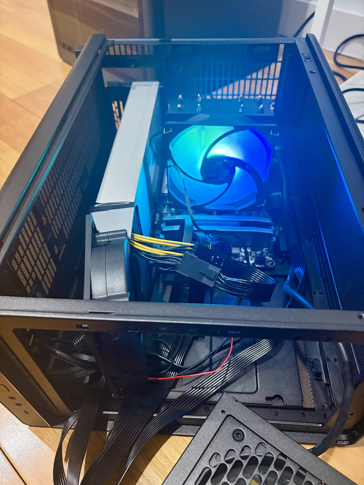
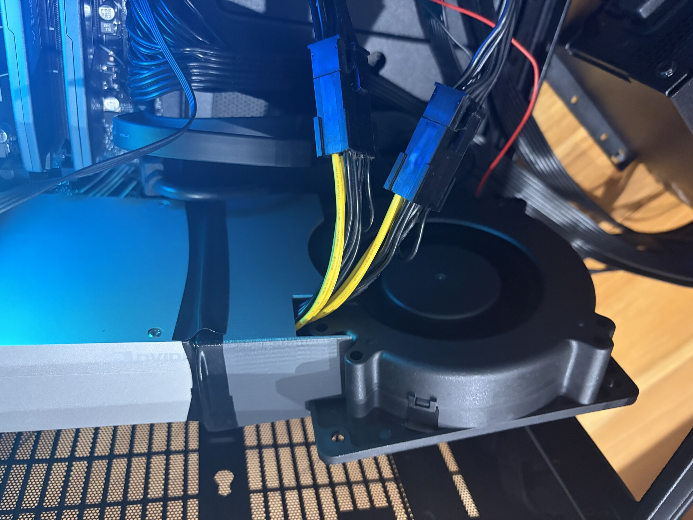
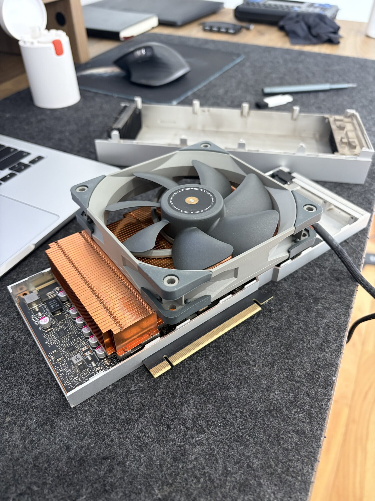
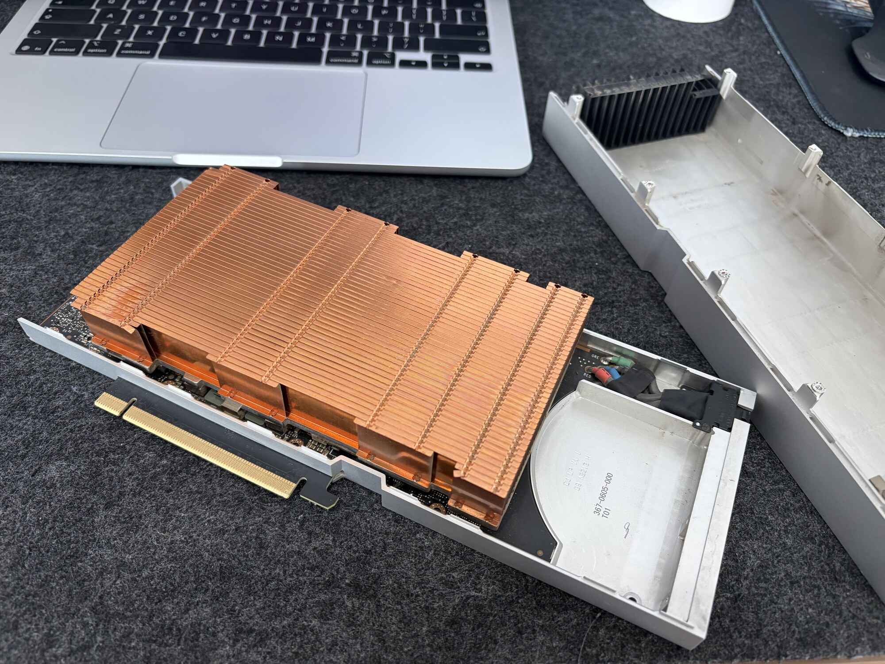

# Air Cooling

The CMP 170HX ships with a passive server heatsink. In a rack aisle with directed airflow that is a feature. On a desk, it is a thermal incident waiting for a CUDA kernel. This page covers forced air through the stock sink. Liquid options live under [Water Cooling](water-cooling.md). Screw-by-screw install warnings stay on 170th Street.

Sources: [Teardown Guide](https://170th-street.gitbook.io/hx/hardware/teardown-guide), [Full Specifications](https://170th-street.gitbook.io/hx/hardware/full-specifications).

## Thermal reality

| Fact | Detail |
|------|--------|
| Stock cooler | Passive dual-slot copper/aluminum server sink |
| Idle power | ~30–40 W (easy) |
| Load envelope | 250 W default, up to ~300 W software |
| Runaway threshold | Above ~**80 °C**, leakage can feed temperature in a positive loop |
| Dry-run rule | Power off within ~**5 minutes** if the card has no coolant / no real airflow |

!!! danger "Thermal runaway"
    GA100 leakage rises with temperature. 170th Street’s watercooling guide warns that dry-running without coolant is a short experiment only: shut down within about five minutes, and treat temperatures above ~80 °C as an emergency stop.

## Forced air through the stock heatsink

Use this for bring-up and light unlock verification.

- Aim **high static pressure** fans directly through the fin stack (open bench or shroud).
- Prefer push or push-pull across the dense fins; random case intake is usually insufficient.
- Watch `nvidia-smi` temperature while you run a short probe, then back off if the curve climbs without plateau.
- Keep dust out of the fins; mining-farm residue is common on surplus cards.

### 120 mm blower + 3D-printed shroud

Desk bring-up setup: a **120 mm** centrifugal blower ducted onto the stock passive sink through a printed shroud. The blower used in lab notes is [this 120 mm unit on Amazon AU](https://www.amazon.com.au/dp/B076X11CT6). Print a shroud that seals against the fin stack so the air actually goes through the heatsink instead of spilling around the sides.

This is enough for unlock verification and light load. Log temperatures under your real CUDA / LLM workload before you trust it overnight. Water is still the quieter long-term path for sustained 250–300 W. See [Water Cooling](water-cooling.md).

### Opening the heatsink shroud (in progress)

!!! info "Waiting for more lab data"
    Same idea as the BC-250 community fin-access mods: open or remove the outer shroud so the dense heatsink fins see real airflow instead of baking under a closed cover. Some builders in China are already running CMP 170HX boards this way. Expect it to work; temperature logs under unlock-level load are still being collected before calling it a proven daily setup.

Pair this with directed fans or the blower+shroud path above. Do not treat an open cover in still room air as enough cooling for a 250–300 W sustained run.

!!! tip "Server chassis"
    A 2U/4U chassis with GPU-directed fans is the stock design intent. If you already own that airflow, you can defer watercooling.

## Monitoring checklist

- [ ] `nvidia-smi -q -d TEMPERATURE,POWER` during first unlock verify
- [ ] Hard stop policy written down (lab default: abort near **80 °C** until cooling is proven)

## When to tear down

You need the heatsink off for:

- Waterblock install
- PCIe capacitor mod access planning
- PCB inspection / repair
- Replacing ruined paste after a thermal event

See [Teardown](teardown.md).

## Related pages

- [Power](power.md)
- [Teardown](teardown.md)
- [Water Cooling](water-cooling.md)
- [Prerequisites](../getting-started/prerequisites.md)

## References

References and further info from:

- https://170th-street.gitbook.io/hx/hardware/teardown-guide
- https://170th-street.gitbook.io/hx/hardware/full-specifications
- https://www.amazon.com.au/dp/B076X11CT6
