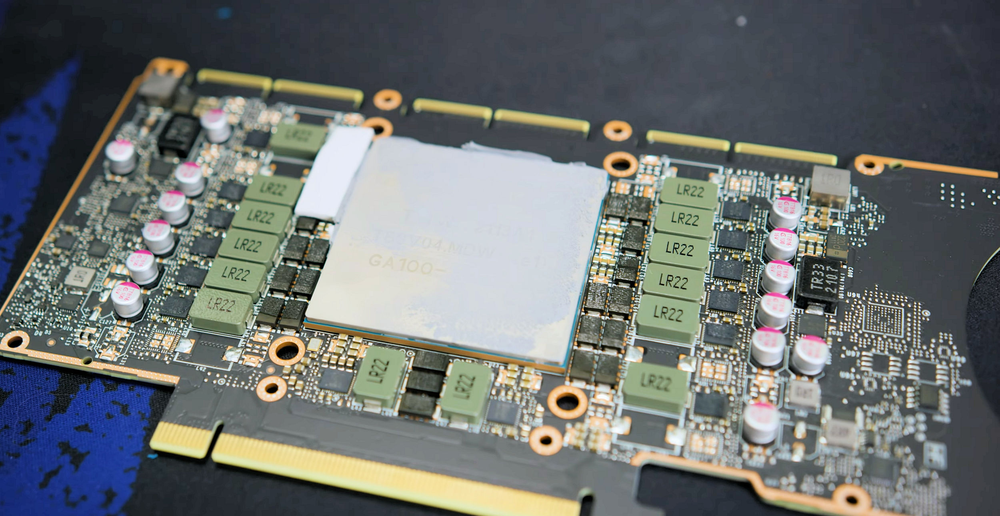

# CMP 170HX Documentation

Documentation for the **NVIDIA CMP 170HX**, a GA100 mining card that the community has turned into a serious budget compute platform. Hardware facts, cooling and power, unlock path, and lab notes from a real unlocked box.

## What is the CMP 170HX?

The CMP 170HX is an NVIDIA-built Cryptocurrency Mining Processor card from 2021. Under the heatsink sits the same GA100 silicon family as the A100 datacenter GPU. NVIDIA sold it as Ethereum mining hardware with compute, memory geometry, and PCIe deliberately clamped. The PCB matches the A100 40GB PCIe reference designators closely enough that A100 schematics and waterblocks map onto it.

Two production SKUs show up in the wild:

| SKU (stock) | PCI ID | Subsystem | Die | Unlocked HBM | Bus | Bandwidth (approx.) |
|-------------|--------|-----------|-----|--------------|-----|---------------------|
| 8 GB | `0x20C2` | `0x1585` | GA100-105F-A1 | **64 GB** | 4096-bit | ~1.49 TB/s |
| 10 GB | `0x2082` | `0x1557` | GA100-105A-A1 | **40 GB** | 5120-bit | ~1.56 TB/s |

- **Compute** (Full Specs, both SKUs): **70 SM / 4480 CUDA / 280 tensor**
- **Clocks:** base **1140 MHz**, boost **1410 MHz**
- **Power:** default TDP **250 W**, software max around **300 W**, idle roughly **30–40 W**
- **APIs:** CUDA Compute Capability **8.0**, OpenCL
- **Display / graphics:** no display outputs; no DirectX / Vulkan / OpenGL / NVENC path

Community unlock tooling ([cmpunlocker](https://github.com/amoghmunikote/cmpunlocker)) restores memory geometry, lifts the FP32 FMA throttle, and enables PCIe Gen2 in software. Hardware lane width still needs the [PCIe capacitor mod](modifications/pcie-capacitor-mod.md) if you want Gen1 x16 (~4 GB/s) instead of stock Gen1 x4 (~1 GB/s).

Lab headline (unlocked 64 GiB): Nemotron-3.5-Lightning-30B-A3B W4A16 at **228 tok/s** (16k coding), batch **1,306 tok/s** aggregate at 32k×16, and **79%** decode retained at 128k versus 1k. Earlier Qwen3.8-27B DFlash ~212 tok/s is still in the matrix. Full tables: [Performance Overview](performance/overview.md).

Primary community sources: [hardware & mod docs](https://170th-street.gitbook.io/hx) and the [GitHub mirror](https://github.com/amoghmunikote/170th-Street). Deep unlock reference: [Consensus-Protocol/cmp170hx](https://github.com/Consensus-Protocol/cmp170hx/wiki). See also [Community](community/community.md).

### Key specifications (at a glance)

- **Architecture:** Ampere GA100 (TSMC 7 nm), ~54.2 billion transistors, 826 mm² die
- **Memory:** HBM2e; stock 8 GB or 10 GB; unlocked **64 GB** (8 GB SKU) or **40 GB** (10 GB SKU)
- **Stock PCIe:** Gen1 x4 (~1 GB/s) via firmware Gen lock plus missing AC coupling caps on 12 of 16 lanes
- **Power:** 1× 8-pin CPU/EPS-style connector via adapter
- **Cooling:** Passive server heatsink; needs strong [airflow](hardware/air-cooling.md) or [water](hardware/water-cooling.md)
- **APIs:** CUDA CC 8.0, OpenCL; no DX / Vulkan / OpenGL / NVENC
- **NVLink:** Connectors present, fuse-disabled
- **Resizable BAR:** Present, limited to **64 MiB** stock
- **History:** NVIDIA CMP line announced 2021; 170HX MSRP about **$4299**; release around **2021-09-01**

!!! warning "Cooling is load-bearing"
    The stock cooler is a passive server brick. Dry-running without coolant or adequate airflow risks thermal runaway above about **80 °C**. Power off within roughly **five minutes** if you ever fire the card without a real cooling path.

!!! tip "PCIe width and Gen are separate knobs"
    Soldering **24× 0402 0.22 µF** caps (for example Samsung CL05B224KO5NNNC) gets you Gen1 x16 (~4 GB/s). That alone does not raise link generation. Gen2 is a software unlock. Details live under [PCIe capacitor mod](modifications/pcie-capacitor-mod.md) and [Linux & Unlock](linux-unlock/unlock-overview.md).

## Quick Links

-   :material-rocket-launch:{ .lg .middle } __Getting Started__

    ---

    Card identity, SKU traps, host prerequisites, and the shortest path from sealed box to unlocked CUDA.

    [:octicons-arrow-right-24: Get Started](getting-started/introduction.md)

-   :fontawesome-solid-microchip:{ .lg .middle } __Hardware__

    ---

    Specs tables, power connector reality, air and water cooling, and a teardown summary with links to the upstream guides.

    [:octicons-arrow-right-24: Hardware Guide](hardware/specifications.md)

-   :material-soldering-iron:{ .lg .middle } __Modifications__

    ---

    PCIe capacitor mod (24× 0402 0.22 µF → Gen1 x16), with links to pad photos in the upstream mod guide. Liquid cooling product notes live under Hardware.

    [:octicons-arrow-right-24: Modifications](modifications/pcie-capacitor-mod.md)

-   :material-linux:{ .lg .middle } __Linux & Unlock__

    ---

    cmpunlocker overview and pointers into the Consensus-Protocol wiki. Do not expect a Falcon/ROP rewrite here.

    [:octicons-arrow-right-24: Unlock Overview](linux-unlock/unlock-overview.md)

-   :material-speedometer:{ .lg .middle } __Performance__

    ---

    Unlocked 64 GiB CMP 170HX lab benches: Nemotron W4A16 at **228 tok/s** (16k coding) and **1,306 tok/s** aggregate batch at 32k×16, with **79%** decode retained at 128k versus 1k.

    [:octicons-arrow-right-24: Performance](performance/overview.md)

-   :material-wrench:{ .lg .middle } __Troubleshooting__

    ---

    Card not seen, Gen stuck at 1, memory still 8/10 GB, DKMS fights, thermal abort, waterblock shorts, driver upgrades.

    [:octicons-arrow-right-24: Troubleshooting](troubleshooting/common.md)

## Critical Requirements

Before you bolt this into a host, treat these as hard gates.

!!! danger "Cooling before load"
    Passive heatsink needs strong directed airflow, or replace it with water. Thermal runaway above ~**80 °C** is a documented failure mode. Dry-run without coolant: power off within ~**5 minutes**.

!!! warning "Host BIOS"
    You need a host that can train a PCIe link to a Gen1 (then Gen2 after unlock) endpoint with Above 4G Decoding enabled for large BAR work. Checklist and setting names: [Host BIOS](bios/host-bios.md).

!!! warning "Linux + specific open driver"
    Community unlock paths target **nvidia-open 610.43.02 / 610.43.03**, matching kernel headers, root, and Secure Boot off. Pin the driver tree before you chase performance numbers.

!!! info "SKU determines unlocked capacity"
    **8 GB stock → 64 GB unlocked.** **10 GB stock → 40 GB unlocked.** Capacity is per SKU and is not interchangeable. The 80 GB configuration on 10 GB cards has been tried and rejected as unstable by community wiki consensus.

!!! tip "Power connector"
    Expect **1× 8-pin CPU/EPS-style** feed via the included adapter. Confirm the pinout matches the shipped mining/server adapter, then budget a quality PSU with headroom above the **250–300 W** GPU envelope.

## Recommended path

1. **Identify the SKU** with `lspci` (device `20c2` vs `2082`) before you buy or unlock. See [Introduction](getting-started/introduction.md).
2. **Build the host** against [Prerequisites](getting-started/prerequisites.md): [airflow](hardware/air-cooling.md) or [water](hardware/water-cooling.md) plan, PSU, Linux install media, Above 4G Decoding.
3. **Seat the card and verify stock identity** (idle power, PCI IDs, Gen1 x4 link) using [Quick Start](getting-started/quick-start.md).
4. **Cool first**, then unlock with cmpunlocker. Read [Air Cooling](hardware/air-cooling.md) / [Water Cooling](hardware/water-cooling.md) and [Unlock Overview](linux-unlock/unlock-overview.md).
5. **Optional hardware mods** after the unlock is stable: [PCIe capacitor mod](modifications/pcie-capacitor-mod.md). Water path: [Water Cooling](hardware/water-cooling.md).
6. **Bench and write numbers back** into [Performance](performance/overview.md).

## Community

This hub points hard at the people who did the reverse engineering.

- [Consensus-Protocol/cmp170hx wiki](https://github.com/Consensus-Protocol/cmp170hx/wiki)
- [amoghmunikote/cmpunlocker](https://github.com/amoghmunikote/cmpunlocker) (canonical unlock tool; forks such as [bayley/cmpunlocker](https://github.com/bayley/cmpunlocker) add P2P work)
- [ServeTheHome Forums: unlocked measurements thread](https://forums.servethehome.com/index.php?threads/cmp-170hx-unlocked-and-measured-164-tflops-fp16-64gb-verified-and-how-to-tell-one-from-an-a100.56137/)

More links live on [Community](community/community.md).

## Quick Start Checklist

- [ ] Confirm SKU (`0x20C2` 8 GB → 64 GB unlock, or `0x2082` 10 GB → 40 GB unlock)
- [ ] Plan cooling ([Air Cooling](hardware/air-cooling.md) on the passive sink, or [Water Cooling](hardware/water-cooling.md) / Bykski N-TESLA-A100-X-V2)
- [ ] PSU with a real 8-pin CPU/EPS feed and headroom for **250–300 W** GPU draw
- [ ] Host BIOS: Above 4G Decoding on; Secure Boot off for patched modules
- [ ] Linux install with nvidia-open **610.43.02** or **610.43.03** and matching headers
- [ ] Stock bring-up: `nvidia-smi` / `lspci` show Gen1 x4 and stock memory size
- [ ] Install cmpunlocker, cold reboot, verify unlocked MiB and Gen2
- [ ] Only then chase capacitor mod, waterblock, or LLM benches

For the step-by-step, see the [Quick Start Guide](getting-started/quick-start.md).

## References

References and further info from:

- https://170th-street.gitbook.io/hx
- https://github.com/amoghmunikote/170th-Street
- https://github.com/amoghmunikote/cmpunlocker
- https://github.com/Consensus-Protocol/cmp170hx/wiki
- https://forums.servethehome.com/index.php?threads/cmp-170hx-unlocked-and-measured-164-tflops-fp16-64gb-verified-and-how-to-tell-one-from-an-a100.56137/
