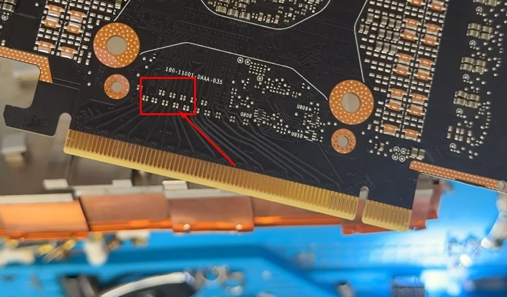

# PCIe Capacitor Mod

Hardware fix for the CMP 170HX lane-width clamp. Stock firmware also locks the link to Gen1; that Gen lock is a **software** unlock. This page is only about the missing AC coupling capacitors that force **x4** width.

Pad identification and screw-by-screw access: [PCIe capacitor mod guide](https://170th-street.gitbook.io/hx/modifications/pcie-capacitor-mod). Amogh Munikote documented the first public confirmation on this card in April 2026.

## Why the link sticks at x4

Twelve of the sixteen PCIe data lanes are missing their AC coupling capacitors on the PCB. Each differential pair needs two caps. Without them the link cannot train those lanes and falls back to **x4**.

| Layer | Problem | Fix |
|-------|---------|-----|
| Width | 12 of 16 lanes lack AC coupling caps | Solder **24× 0402 0.22 µF** |
| Generation | Firmware Gen1 lock | cmpunlocker Gen2 path ([Unlock Overview](../linux-unlock/unlock-overview.md)) |

After caps only: **Gen1 x16** (about **4 GB/s**). After caps **and** Gen2 unlock: Gen2 x16 when the host and card both cooperate (field reports exist; treat Gen2×16 as higher variance than Gen1×16).



Empty AC coupling pads sit just inland of the gold fingers on the back of the board (marked above). Each missing differential pair needs two **0402** caps.

## Parts

| Item | Spec |
|------|------|
| Capacitance | **0.22 µF** (220 nF) |
| Package | **0402** |
| Dielectric / voltage | X7R, **≥16 V** |
| Quantity | **24** installed (order **≥30**; 0402 losses are real) |
| Confirmed example | Samsung **CL05B224KO5NNNC** (DigiKey 1276-1176-1-ND) |

0.22 µF matches the NVIDIA A100 GA100-883 reference schematic value cited in the upstream mod guide (P1001-B02, PCIe connector IO page). Equivalent X7R 0402 0.22 µF parts from other vendors are fine if the footprint and voltage rating match.

Reference designators on the schematic sit in the **C1100–C1350** range (for example C1120 / C1125 / C1130 / C1135 per differential pair). Empty pads show copper with no component, along the lane routing between the gold fingers and the GPU.

## Skill bar

- Comfortable **0402** SMD work (hot air or fine tip)
- Magnification (microscope or loupe)
- Practice board recommended if 0402 is new to you

This is a real board-rework job. Flux residue, bridges, and lifted pads will ruin a surplus card faster than a bad driver pin.

## High-level steps

1. Complete [teardown](../hardware/teardown.md) far enough to access the empty pads (slide-out / heatsink sequence on the Teardown page).
2. Identify all **24** empty AC coupling positions against the mod-guide photos / schematic callouts.
3. Clean pads, apply flux, place and reflow each **0.22 µF 0402**.
4. Inspect every joint under magnification. Check for bridges to neighbors and for tombstoned parts.
5. Clean flux. Reassemble or proceed to waterblock prep.
6. Boot and verify link width (below).

!!! danger "Dangers"
    Shorts across a differential pair or to ground will take out lanes or the whole endpoint. Do not probe powered gold fingers with a clumsy iron. Work unpowered, ESD-safe, and confirm continuity only with a plan (probing guidance is in the mod guide linked above). If you are unsure, stop and pay someone who does 0402 daily.

## Verification

```bash
sudo lspci -s <bus:dev.fn> -vvv | grep LnkSta
```

| State | Typical `LnkSta` |
|-------|------------------|
| Stock | Speed **2.5 GT/s**, Width **x4** (often marked downgraded) |
| Caps done, Gen unlock not applied | Speed **2.5 GT/s**, Width **x16** |
| Caps + Gen2 unlock | Speed **5.0 GT/s**, Width **x16** when both layers stick |

Community validation on this card moved width from x4 to x16 at Gen1. Gen2 remains the software half.

## Related pages

- [Unlock Overview](../linux-unlock/unlock-overview.md)
- [Teardown](../hardware/teardown.md)
- [Specifications](../hardware/specifications.md)
- [Troubleshooting](../troubleshooting/common.md)

## References

References and further info from:

- https://170th-street.gitbook.io/hx/modifications/pcie-capacitor-mod
- https://github.com/amoghmunikote/170th-Street/blob/master/modifications/pcie-capacitor-mod.md
- https://170th-street.gitbook.io/hx
- https://github.com/Consensus-Protocol/cmp170hx/wiki
