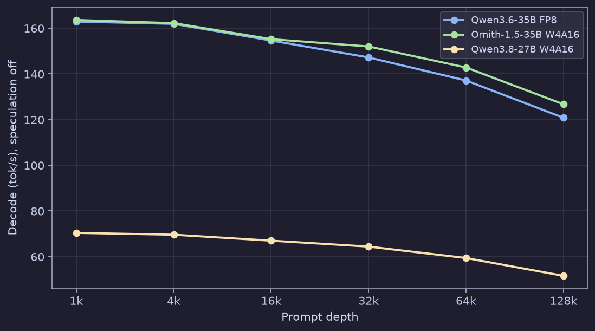
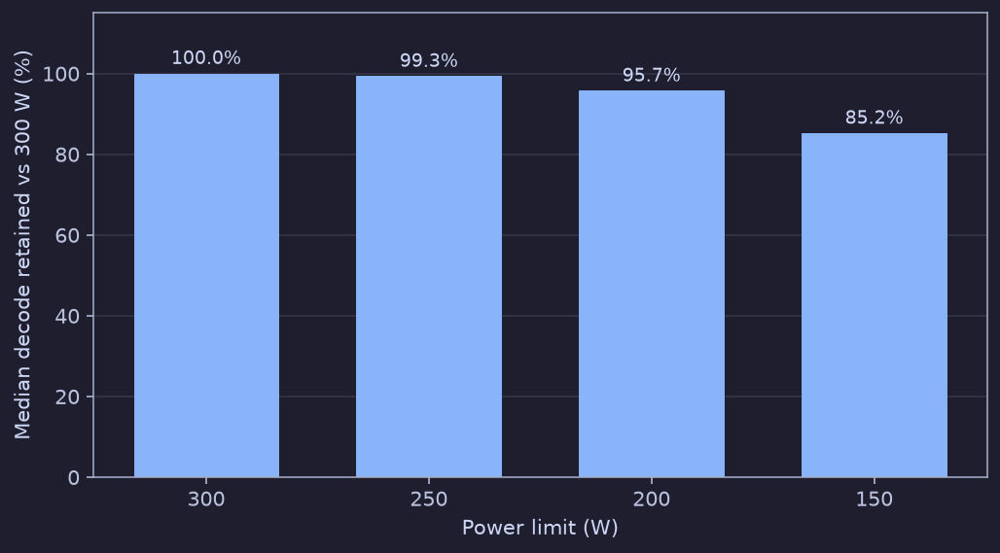
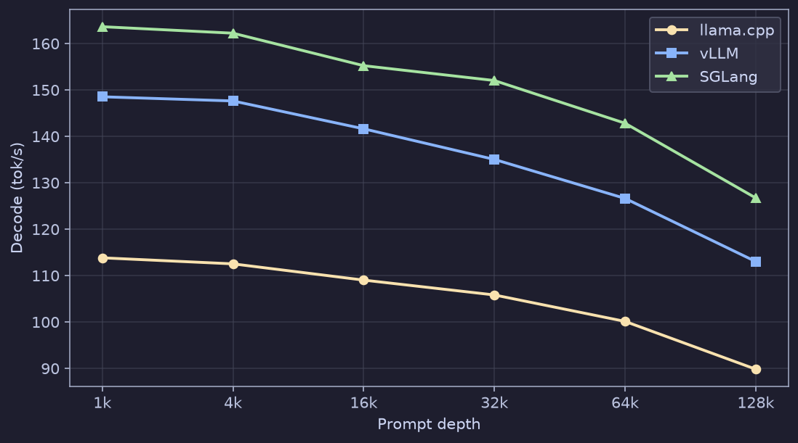
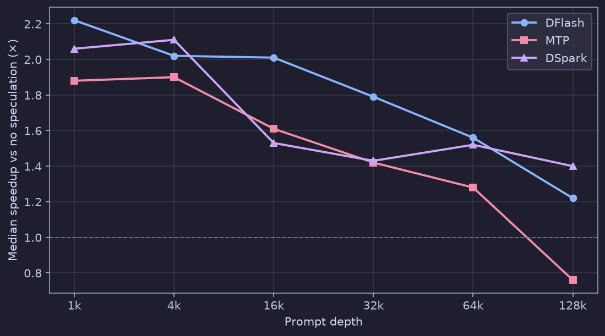
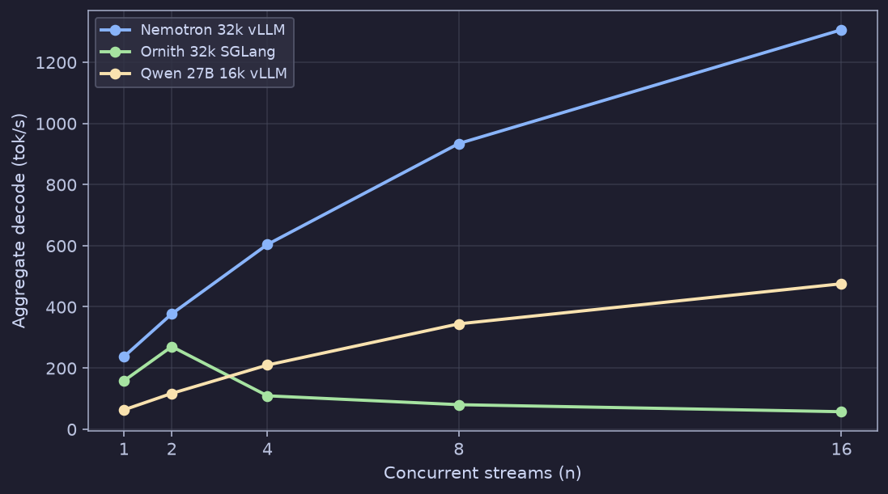

# Performance Overview

Lab decode numbers from an unlocked **CMP 170HX** (64 GiB HBM2e, ~1.49 TB/s, PCIe Gen2 x4, 150-300 W) running **vLLM**, **llama.cpp**, and **SGLang**. The source sweep covers **1,603 decode points** across **16 models** at prompt depths from 1k to 128k. Workload numbers below focus on 16k, 32k, and 64k.

| GPU | VRAM | Bandwidth | PCIe | Engines | Power |
|-----|------|-----------|------|---------|-------|
| GA100 sm_80 | 64 GiB HBM2e | ~1.49 TB/s | Gen2 x4 | vLLM, llama.cpp, SGLang | 150-300 W |

## Headline numbers

| Metric | Value |
|--------|-------|
| 16k coding | **228 tok/s** (Nemotron-3.5-Lightning-30B-A3B W4A16, vLLM, 1,024-token output, 1.7 s TTFT) |
| 64k longcode | **218 tok/s** (same model, 2,048-token output, 7.8 s TTFT) |
| 32k batch | **1,306 tok/s** aggregate (Nemotron W4A16, vLLM, 16 streams at 32k prompts) |
| At 128k | **79%** of the 1k-context decode rate (speculation off) |

## What to run

| Job | Model | Engine | 16k | 64k |
|-----|-------|--------|-----|-----|
| Interactive | Nemotron-3.5-Lightning-30B-A3B W4A16 | vLLM | 228 tok/s, 1.7 s TTFT | 218 tok/s, 7.8 s TTFT |
| Fast MoE | Ornith-1.5-35B-A3B W4A16 | SGLang | 155 tok/s, 1.3 s TTFT | 142 tok/s, 7.8 s TTFT |
| Batch at 16k | Qwen3.8-27B W4A16-fast | vLLM | 602 tok/s at 32 streams | See 16k concurrency |
| Batch at 32k | Nemotron-3.5-Lightning-30B-A3B W4A16 | vLLM | 1,306 tok/s at 16 streams | n=32 does not fill (17 running). Ornith MoE peaks at 270 tok/s at n=2. |

## Coding and long-context generation

Decode and TTFT with speculation off, 300 W, coding-style prompts.

| Model | Quant | Engine | 16k decode | 16k TTFT | 64k decode | 64k TTFT |
|-------|-------|--------|------------|----------|------------|----------|
| Nemotron-3.5-Lightning-30B-A3B-W4A16 | W4A16 | vLLM | 227.7 | 1.7 s | 217.9 | 7.8 s |
| Ornith-1.5-35B-A3B-W4A16 | W4A16 | SGLang | 154.8 | 1.3 s | 141.9 | 7.8 s |
| Qwen3.6-35B-A3B-FP8 | FP8 | vLLM | 153.8 | 1.6 s | 135.9 | 9.1 s |
| Ornith-1.5-35B-A3B-W4A16 | W4A16 | vLLM | 140.2 | 1.5 s | 125.5 | 8.5 s |
| Qwen3.8-27B-INT8-W8A16-MTP | INT8-W8A16 | vLLM | 43.5 | 8.6 s | 39.2 | 40.5 s |
| Ornith-1.5-35B-A3B-GGUF | Q5_K_M | llama.cpp | 108.9 | 9.1 s | 99.7 | 42.2 s |

## Context depth

Decode against prompt depth with speculation off. The chart shows the three fastest families from the model ladder. The table is the median retained rate across every model and engine that ran both that depth and the 1k reference.

*Figure: Nospec decode versus prompt depth for Qwen3.6-35B FP8, Ornith-1.5-35B W4A16, and Qwen3.8-27B W4A16 at 1k, 4k, 16k, 32k, 64k, and 128k on the unlocked CMP 170HX at 300 W.*

| Depth | Decode retained vs 1k | Measurements |
|-------|----------------------|--------------|
| 1,024 | 100.0% | 75 |
| 4,096 | 99.0% | 75 |
| 16,384 | 96.2% | 75 |
| 32,768 | 93.5% | 75 |
| 65,536 | 88.1% | 75 |
| 131,072 | 79.4% | 56 |

The drop stays small through 16k and shows up past 64k. 64 GiB is what keeps 128k usable: a 27B model holds about 8 GiB of KV there, which does not fit next to the weights on a 24 GB card.

## Power limit

Every ladder point was repeated at 300, 250, 200, and 150 W (210 matched measurements).

*Figure: Median decode retained versus the 300 W baseline at 300 W, 250 W, 200 W, and 150 W on the unlocked CMP 170HX.*

| Limit | Decode retained | p10-p90 | Power budget |
|-------|-----------------|---------|--------------|
| 300 W | 100.0% | 100.0-100.0% | 100% |
| 250 W | 99.3% | 96.1-101.3% | 83% |
| 200 W | 95.7% | 89.8-100.1% | 67% |
| 150 W | 85.2% | 77.4-97.6% | 50% |

250 W keeps 99.3% of the 300 W rate. 200 W keeps 95.7% on two-thirds the power. 150 W keeps 85.2%.

## Engines compared

Same underlying Ornith-1.5-35B-A3B at ~4-5 bit, same depth, 300 W, speculation off. llama.cpp is GGUF; vLLM and SGLang are compressed-tensors. The weight files are not identical.

*Figure: Ornith-1.5-35B-A3B at roughly 4 to 5 bit, speculation off, decode across llama.cpp, vLLM, and SGLang from 1k to 128k prompt depth.*

SGLang leads on the MoE W4A16 path (163.6 tok/s at 1k, 126.7 at 128k). vLLM sits a step behind on the same model. llama.cpp lands around 70% of SGLang on this 35B MoE.

Compact Qwen3.8-27B 4-bit row at 16k for engine orientation: llama.cpp 36.8, vLLM 62.4, SGLang 67.0 tok/s.

## Speculative decoding

Median gain over the same configuration with speculation off, by depth. Values come from the bench JSON (`D.spec`), which fills the broken `{:.2f}` placeholders in the HTML export.

*Figure: Median speculative speedup for DFlash, MTP, and DSpark versus prompt depth from 1k to 128k, relative to the matched nospec run.*

| Method | 1,024 | 4,096 | 16,384 | 32,768 | 65,536 | 131,072 |
|--------|-------|-------|--------|--------|--------|---------|
| DFlash | 2.22× | 2.02× | 2.01× | 1.79× | 1.56× | 1.22× |
| MTP | 1.88× | 1.90× | 1.61× | 1.42× | 1.28× | 0.76× |
| DSpark | 2.06× | 2.11× | 1.53× | 1.43× | 1.52× | 1.40× |

DFlash is 2.22× at 1k and 1.22× at 128k. MTP falls to 0.76× at 128k, where the drafter costs more than it returns. Quote a speculative number at the depth you actually use.

## Concurrent decode (workload)

256-token outputs. Quote 16k and 32k for real work. Empty-cache 1k/4k tables can print 3,168 tok/s on Ornith; that figure is 1k-only. At 32k the same model peaks at 270 tok/s with two streams.

*Figure: Aggregate decode versus concurrent stream count (n=1..16) for Nemotron at 32k on vLLM, Ornith at 32k on SGLang, and Qwen 27B at 16k on vLLM.*

### vLLM Nemotron 30B-A3B, 32k context

| | n=1 | n=2 | n=4 | n=8 | n=16 |
|---|-----|-----|-----|-----|------|
| decode agg | 237 | 377 | 604 | 934 | 1,306 |
| per-stream | 240 | 124 | 65 | 34 | 17 |
| TTFT | 3.3 s | 5.2 s | 8.7 s | 16.0 s | 31.0 s |
| KV / running | 0.6% / 1 | 1.2% / 2 | 2.5% / 4 | 4.9% / 8 | 9.9% / 16 |

Ornith 32k on SGLang peaks at **270 tok/s aggregate at n=2**, then falls as waiting queues grow. Qwen3.8-27B W4A16-fast at 16k on vLLM reaches **602 tok/s at n=32**.

## Quality (Qwen3.8-27B, this card)

| Benchmark | n | bf16 | INT8 | W4A16 | W4A16 vs bf16 |
|-----------|---|------|------|-------|---------------|
| HumanEval pass@1 | 164 | 0.939 | 0.939 | 0.927 | −1.3% |
| HumanEval+ pass@1 | 164 | 0.762 | 0.707 | 0.677 | −11.2% |
| GSM8K flexible | 1,319 | 0.544 | 0.531 | 0.529 | −2.8% |
| GSM8K strict | 1,319 | 0.532 | 0.532 | 0.444 | −16.4% |
| IFEval inst strict | 541 | 0.447 | 0.448 | 0.446 | −0.3% |

## Method

- One CMP 170HX, blower on a temperature-driven curve. Runs without it were discarded.
- Identical serving flags per engine, `--gpu-memory-utilization 0.85` throughout.
- Each ladder ran three times after one discarded warmup pass.
- Prompt depths calibrated against the server's own tokenizer.
- Output length forced with `ignore_eos` and `min_tokens`.
- Wall-clock decode is replaced when it disagrees with the server's timing by more than 2×.
- PCIe trained at Gen1 x4 (0.84 GB/s) for runs before 2026-09-10, Gen2 x4 (1.69 GB/s) after a reseat. A matched SGLang ladder on the new link reproduced every depth within 0.3%.
- Every run writes its prompts and completions to disk.

## Further reading

Community reports and tools on [Localmaxxing](https://www.localmaxxing.com/en/reports):

- [Community reports index](https://www.localmaxxing.com/en/reports) (includes **CMP 170HX: Qwen3.8-27B AutoRound + DFlash2 at 131k**)
- [Hardware hub](https://www.localmaxxing.com/en/hardware) (CMP 170HX listed with community runs; single-GPU median around 71 tok/s across a large sample)
- [Decode calculator](https://www.localmaxxing.com/en/decode-calculator)

Optional stack-comparison context from the same reports index on dual **RTX 3090 TP2** (separate hardware from this 170HX lab): MTP vs DFlash, and vLLM vs SGLang DFlash2.
